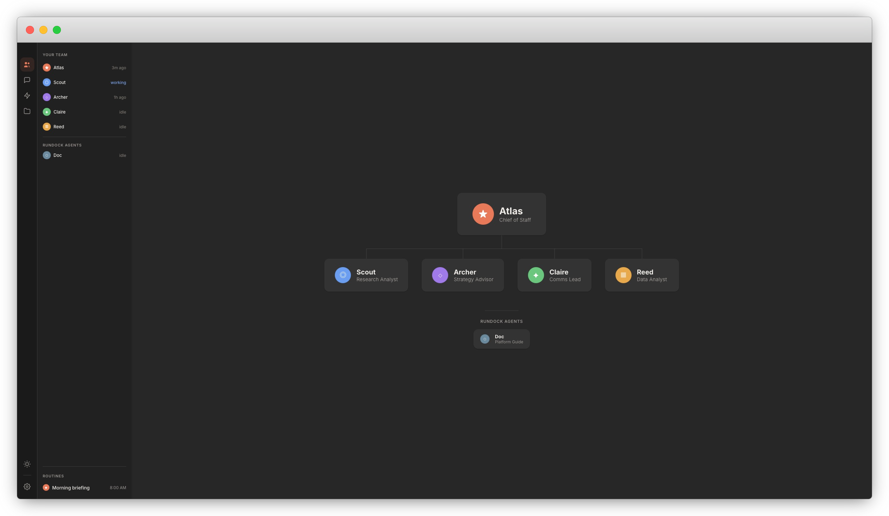

# Rundock

A browser-based OS for AI agent teams. Built for knowledge work, powered by Claude Code.

**Already using Claude Code?** Rundock surfaces what the terminal hides: which agents you have, which skills they use, and what's happening across your conversations. Same `.claude/` directory, same agent files, new visibility.

Rundock gives knowledge workers a visual way to build and manage AI agent teams: an org chart, conversations, skill management, and file browsing. For product managers, researchers, strategists, consultants, writers, analysts, and operations leads.

**Rundock is not designed for coding or building apps.** It's built around markdown files and knowledge workspaces. If you're looking for AI-assisted development, use Claude Code directly in your terminal or IDE.



## Prerequisites

- **Node.js** 20+ ([nodejs.org](https://nodejs.org))
- **Claude Code** installed and signed in ([install guide](https://docs.anthropic.com/en/docs/claude-code/overview)). Run `claude` in your terminal to sign in. Claude Code requires a Claude Pro or Max subscription.

Already have both? Skip to quick start.

## Quick start

```bash
git clone https://github.com/liamdarmody/rundock.git
cd rundock
npm install
npm start
```

Open [http://localhost:3000](http://localhost:3000) in your browser.

You'll see a workspace picker. Choose a folder that contains (or will contain) your knowledge base and agents. A workspace is any folder where you keep your work: documents, research, projects. This should be separate from the Rundock install folder. If you already have a `.claude/agents/` directory, Rundock will discover it automatically.

**New to Rundock?** Doc, the built-in guide, analyses your workspace and proposes an agent team. Say go, and your agents appear on the org chart. Start a conversation and put them to work.

To open a specific workspace directly:

```bash
WORKSPACE=/path/to/your/folder npm start
```

## Updating

From the Rundock install directory (where you cloned the repo):

```bash
cd /path/to/rundock
npm run update
```

Pulls the latest changes and reinstalls dependencies. Then run `npm start` as usual.

## Your team at a glance

**Team:** See your agents on an org chart with zoom controls. Click any agent to view their profile with role, capabilities, skills, and routines. The chart scales to any team size.

**Delegation:** Orchestrator agents route work to the right specialist mid-conversation. You see who's active in the sidebar, and specialists hand back when the request moves outside their domain. The orchestrator picks up where they left off.

**Conversations:** Chat with any agent through the browser. Run multiple conversations in parallel, each with its own agent and session context. Search across conversation titles and full transcript history to find past work. Claude Code has no built-in way to search session content; Rundock does.

**Skills:** See which agents use which skills at a glance. In Claude Code, skill-to-agent assignments are invisible. Rundock surfaces the full map.

**Files:** Your agents read and write files in your workspace. Browse, preview, and edit those same files with full markdown rendering.

## Setting up your workspace

**Already have Claude Code agents?** Rundock discovers them from `.claude/agents/`. They'll appear on the org chart. Add a few optional frontmatter fields to customise how they display.

**Starting fresh?** Create a new workspace from the picker, or open any folder. Rundock includes a built-in guide called Doc who will walk you through creating your first agent and setting up your workspace.

### Agent frontmatter

Rundock reads standard Claude Code agent frontmatter and adds optional fields for the visual layer:

```yaml
---
# Standard Claude Code fields
name: project-manager
description: >
  Tracks projects, surfaces blockers, and keeps work on schedule.
model: sonnet

# Rundock extension fields (all optional)
displayName: Marshall
role: Project Manager
type: specialist
order: 1
icon: ◎
colour: #6B9EF0
prompts:
  - "What needs my attention today?"
  - "Help me plan next week"
---
```

| Field | Purpose |
|---|---|
| `displayName` | Human-friendly name for the UI. Falls back to title-cased `name` if not set |
| `role` | Short title on org chart (2-4 words) |
| `type` | `orchestrator`, `specialist`, or `platform`. Determines org chart position |
| `order` | Position on org chart. Orchestrator is 0, specialists numbered after |
| `icon` | Single unicode character for the avatar circle |
| `colour` | Hex colour for the avatar background |
| `prompts` | List of starter prompts shown as pills when starting a new conversation |
| `reportsTo` | Agent slug this agent reports to. Enables multi-level org chart hierarchies |

## Your data never leaves your computer

```
Browser (WebSocket) <-> Node.js server <-> Claude Code CLI (one process per conversation, delegates spawn additional processes)
```

- **server.js:** Discovers agents, skills, and files. Spawns Claude Code processes for conversations. Manages delegation between agents, permission cards, and session continuity.
- **public/index.html:** Single-page app with nav rail, sidebar, and main panel.
- **Claude Code:** Runs as child processes in interactive stream-json mode. Each conversation gets its own persistent process with session continuity via `--resume`. Follow-up messages push to stdin rather than spawning new processes. Delegation spawns a second process for the specialist, parking the orchestrator until the specialist returns.

Everything runs on your machine. No data is sent anywhere other than Anthropic's API (through Claude Code). Same workspace files are accessible to Rundock, Claude Code, Obsidian, VS Code, or any other tool simultaneously.

## Security and privacy

**Rundock runs entirely on your machine.** There is no cloud service, no account to create, no database, and no telemetry. Here's what that means in practice.

**Your data stays local.** Rundock is a local Node.js server that talks to Claude Code on your computer. The only external connection is from Claude Code to Anthropic's API, which is how Claude processes your messages. Rundock itself makes zero outbound network calls.

**Your API key is managed by Claude Code, not Rundock.** When you install Claude Code and sign in, it stores your authentication locally on your machine. Rundock never sees, stores, or transmits your API key. If you've already authenticated with Claude Code in your terminal, Rundock uses that same session.

**Agents can read and write knowledge files in your workspace.** Rundock runs Claude Code with permissions that allow agents to read files, write markdown and knowledge files, and browse your workspace freely. Agents do not have access to files outside your workspace.

**Terminal commands require your approval.** When an agent needs to run a command (Bash), a permission card appears in the conversation with the command details, risk level, and Allow/Deny buttons. You can also choose "Always Allow" to auto-approve a command pattern for the rest of your session. High-risk commands (rm, sudo, chmod) are flagged with a warning. Cards auto-deny after two minutes if you don't respond.

**Executable code is blocked by design.** Agents cannot write or edit code files (.js, .ts, .py, .sh, and other executable formats). Rundock is built for knowledge work, not software development.

**The codebase is small and auditable.** Two source files (server.js and public/app.js), two dependencies (a markdown renderer and a WebSocket library). No build step, no bundler. You can read the entire codebase in an afternoon.

**Nothing is stored in the cloud.** Conversation metadata (title, agent, session ID) is saved to a `.rundock/` directory in your workspace so sessions persist across page reloads. Message content is read from Claude Code's own JSONL transcript files on disk when resuming a previous conversation. Rundock does not store message content separately. Your workspace files are plain files on disk. Theme preference is saved in your browser's local storage. A list of recently opened workspaces is saved to a local file in the Rundock install directory. That's it.

For technical users: the full source is in `server.js` (Node.js HTTP + WebSocket server, agent/skill discovery, delegation, Claude Code process management) and `public/app.js` (single-page client application). No build step, no bundler, no minification.

## Common issues

**"Command not found: claude"**

Claude Code isn't installed or isn't in your PATH. Install it from [code.claude.com](https://code.claude.com) and verify `claude --version` works in your terminal.

**No agents on the org chart**

Your workspace doesn't have `.claude/agents/` or the agent files are missing Rundock frontmatter. Add `type` and `order` fields to place agents on the org chart.

**Agent shows as a title-cased slug instead of a name**

Add `displayName: Your Name` to the agent's frontmatter. Without it, Rundock title-cases the `name` field (e.g. `project-manager` becomes "Project Manager").

**Skills list is empty**

Rundock looks for skills in `.claude/skills/` (SKILL.md files). Skills are also discovered from `System/Playbooks/` (PLAYBOOK.md files) if that directory exists in your workspace.

**Conversations disappear on refresh**

Conversation metadata persists across reloads. Previous conversations appear in a collapsible "Previous" section in the sidebar. Click one to resume: Rundock loads the message history from Claude Code's JSONL transcript files on disk. Messages from the previous session appear faded with a "Previous session" divider.

## Licence

PolyForm Perimeter 1.0.0. Use Rundock for any purpose, including commercial. The one restriction: you cannot use this code to build a product that competes with Rundock. See [LICENSE](LICENSE) for the full terms.

## Feedback

Early access. If you find bugs or have ideas, open an issue at [github.com/liamdarmody/rundock/issues](https://github.com/liamdarmody/rundock/issues).
