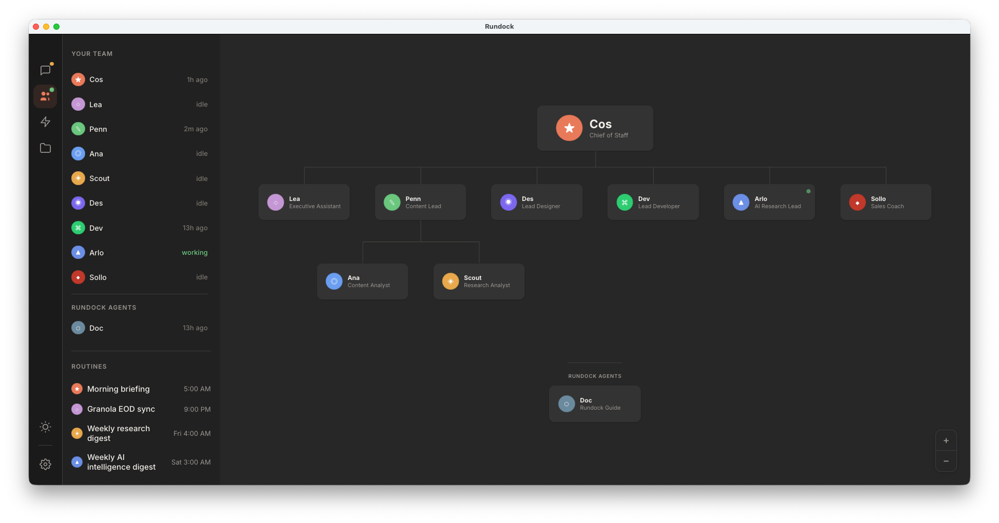

# Rundock

[](LICENSE)
[](https://github.com/liamdarmody/rundock/releases)

A visual interface for AI agent teams. Built by someone running their own business, for people running their own.

You run content, ops, sales, admin, and research. When you started, there was nobody else, so the work fell to you. A single chatbot is a single assistant. An agent platform built for developers assumes you can write code. Rundock gives you a team you can actually manage: an org chart of named specialists, conversations through the browser, and delegation that happens in front of you. One beta user described it as having a virtual team of highly paid experts, running in parallel. That is the experience.

Built by [Liam Darmody](https://www.linkedin.com/in/liamdarmody/).



## Principles

Five ideas shape every decision in Rundock: **local-first**, **markdown all the way down**, **the human leads**, **the team is the unit of value**, and **built from real use**.

Read the full version at [docs.rundock.ai/principles](https://docs.rundock.ai/principles).

## Getting started

You do not need to write code. You need Claude Code and a folder to call your workspace.

1. Install [Claude Code](https://docs.anthropic.com/en/docs/claude-code/overview) and sign in. Requires a Claude Pro or Max subscription.
2. Download the latest [Rundock release](https://github.com/liamdarmody/rundock/releases) (`.dmg` for Apple Silicon Macs, M1 or later). For Intel Mac, Windows, or Linux, see Local setup below.
3. Open Rundock and follow Doc, the built-in guide, through first-run setup. Doc walks you through choosing a workspace and creating your first agents.

## Run on Windows (interim)

A proper Windows installer is on the way. Until it ships, the recommended path for non-developer Windows users is the from-source bootstrap below.

Open PowerShell and run:

```powershell
irm https://raw.githubusercontent.com/liamdarmody/rundock/main/scripts/install-windows-source.ps1 | iex
```

The bootstrap takes care of five things end to end: it checks for Node.js 20+ and Git (and installs them via `winget` if missing), checks for Claude Code (and prompts to run Anthropic's installer if missing), clones Rundock to `%USERPROFILE%\Rundock`, runs `npm install`, and creates a Desktop and Start Menu shortcut. After it finishes, double-click the Rundock shortcut to launch.

If `winget` itself is missing on an older Windows 10 machine, install **App Installer** from the Microsoft Store:

```
ms-windows-store://pdp/?productid=9NBLGGH4NNS1
```

If you would prefer to install Claude Code yourself first, run Anthropic's installer in PowerShell, then run the Rundock bootstrap:

```powershell
irm https://claude.ai/install.ps1 | iex
irm https://raw.githubusercontent.com/liamdarmody/rundock/main/scripts/install-windows-source.ps1 | iex
```

Re-running the bootstrap one-liner is safe at any time. It updates the existing checkout in place.

This path is interim and will be retired when the proper Windows installer ships.

## Local setup (for contributors and other platforms)

For Intel Macs, Windows, Linux, or anyone wanting to build from source.

**Requirements:** Node.js 20+ and Claude Code authenticated (`claude --version` should work in your terminal).

```bash
git clone https://github.com/liamdarmody/rundock.git
cd rundock
npm install
npm start
```

Open [http://localhost:3000](http://localhost:3000) in your browser. To open a specific workspace directly:

```bash
WORKSPACE=/path/to/your/folder npm start
```

To pull updates later, run `npm run update` in the install directory.

## Tech docs

- [ARCHITECTURE.md](ARCHITECTURE.md): the process model, workspace directory, and codebase structure.
- [AGENTS.md](docs/AGENTS.md): the agent file format reference. Frontmatter fields, the markdown body, workspace modes, and a complete example.
- [SKILLS.md](docs/SKILLS.md): the skill file format, discovery, and the assignment model.
- [ROUTINES.md](docs/ROUTINES.md): the schedule format, scheduler behaviour, and where output goes.
- [CONTRIBUTING.md](CONTRIBUTING.md): dev setup, code structure, conventions, changelog standards.
- [CHANGELOG.md](CHANGELOG.md): release history.
- [LICENSE](LICENSE): PolyForm Perimeter 1.0.0.

## Security

The entire stack runs on your machine. Rundock never sends your files, your agents, or your conversations anywhere. The only external connection is from Claude Code to Anthropic's API, which is how Claude processes your messages. Only the active conversation is sent to Anthropic for processing. Rundock itself makes zero outbound network calls. There is no cloud service, no account to create, no database, no telemetry. Your API key is managed by Claude Code, not Rundock.

## Licence

PolyForm Perimeter 1.0.0. Fork it, audit it, learn from it. The one thing you cannot do is use the source to build a product that competes with Rundock. See [LICENSE](LICENSE) for the full terms.

## Feedback

Early access. Bugs and ideas welcome at [github.com/liamdarmody/rundock/issues](https://github.com/liamdarmody/rundock/issues).

<!--
================================================================================
OPTIONAL: WALKTHROUGHS SECTION TEMPLATE
================================================================================
If Liam records three short Loom walkthroughs (60-90 seconds each) covering
(a) opening Rundock and seeing the org chart, (b) starting a conversation and
watching delegation happen, (c) adding or editing a skill, paste the section
below directly after the hero screenshot and above the Principles section.
Replace the TODO placeholder URLs with the real Loom share URLs.

## Walkthroughs

Three short videos. Each is around 60 to 90 seconds.

- [Opening Rundock and seeing your team](https://www.loom.com/share/TODO-org-chart): workspace picker, org chart, agent profiles.
- [Starting a conversation and watching delegation happen](https://www.loom.com/share/TODO-delegation): talk to one agent, watch them hand work to a specialist.
- [Adding and editing a skill](https://www.loom.com/share/TODO-skills): what skills are, who they belong to, and how to write one.

================================================================================
END OPTIONAL TEMPLATE
================================================================================
-->
